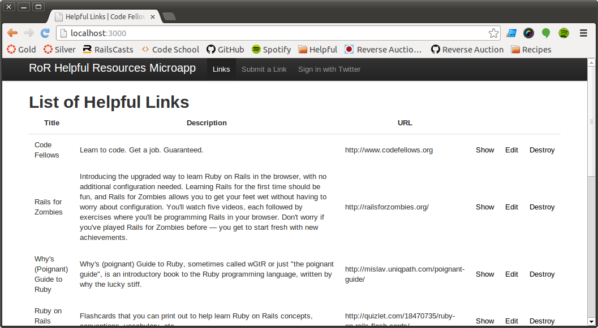
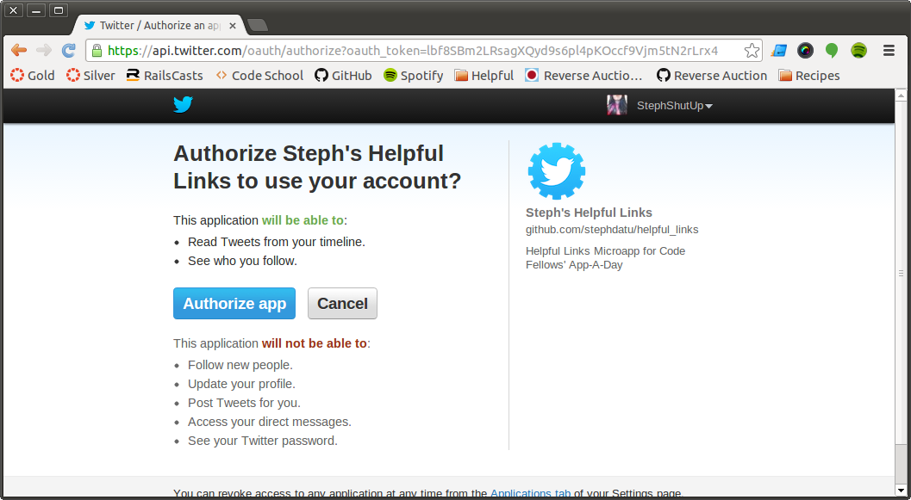
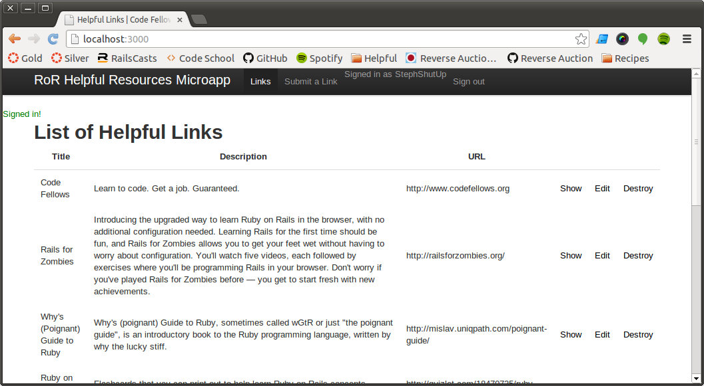

# Code Fellows App-A-Day: Helpful Links
By [Stephanie Datu](http://blog.stephdatu.com)

This is a collection of Ruby on Rails resources to help in your learning. All new submitted links are shown at the top of the page. You can sign in via Twitter through Omniauth.

### Submitting your link
  1. From the homepage, click on the "Submit a Link" menu option at the top or "New Link" on the bottom. This will bring you to a new page where you can enter your information. (*Optional*: Sign in via Twitter at the top link)
  2. Add the *Title* of the URL.
  3. Give a brief description of the website.
  4. Add in the URL (*http://www.example.com*).
  5. Click "Create Link" when you've added all your information. A confirmation page will show your data and give you the option to "Edit" your information or go back to the homepage.

### Screenshots

View of the homepage

View of the Twitter sign in page via Omniauth

View of the homepage when signed in

###Author
* Stephanie Datu (https://github.com/stephdatu)
* HTML/CSS design source: http://guides.railsgirls.com/design/

### License

http://stephdatu.mit-license.org/
